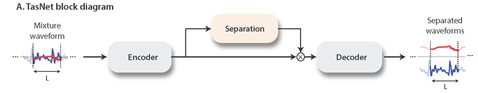

# AlkaidAudioSepration

A tool for vocal and noise separation in single or two person conversation scenarios.

Model
=====

Base



Ours


Deployment In Windows CPU
=========================


# Usage scenarios for `Alkaid.exe`

|                   | number of src: `n_src` | Presence of noise:`is_noisy` | output                                  |
| :---------------: | :--------------------: | :--------------------------: | --------------------------------------- |
|    src + noise    |           1            |              1               | `src.wav` and `noise.wav`               |
|    src1 + src2    |           2            |              0               | `src1.wav` and `src2.wav`               |
| src1 + src2+noise |           2            |              1               | `src1.wav` and `src2.wav` and `noise.wav` |

# Quiak start

- Download this repo

```powershell
git clone https://github.com/shaochengyan/AlkaidAudioSepration.git
cd ./AlkaidAudioSepration
```

- Use `Alkaid.exe` to process the two person conversion record in `./data/0.wav`

```
.\Alkaid.exe 2 1 .\data\0.wav
```

- And you well see the output like this

```
===== Options =====
n_src=2
is_noisy=1
.\data\0.wav
===== End =====
=====Processing:.\data\0.wav=====
M1 Latency = 211 (ms)
Output filename=.\data\0/noise.wav
M2 Latency = 404 (ms)
Output filename=.\data\0/src1.wav
Output filename=.\data\0/src2.wav
=====End=====
Duration = 638 (ms)
```

