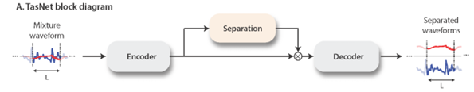
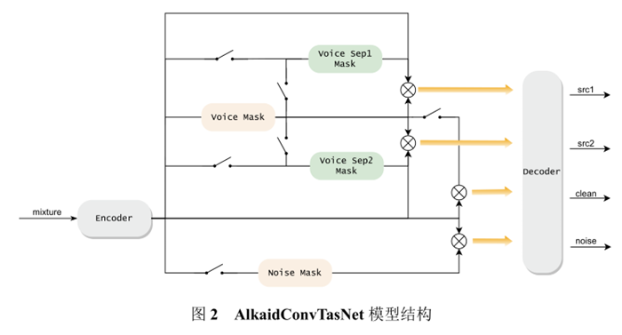
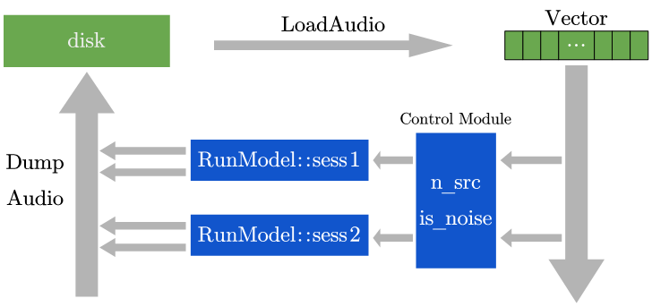

# AlkaidAudioSepration
A tool for vocal and noise separation in single or two person conversation scenarios.

模型
----

基于ConvTasNet：



设计的模型：



Windows端CPU推理模型部署
========================




使用说明😉
========

必看
----

> **请勿在中文路径下运行！**

`Alkaid.exe`使用情景
--------------------

|       场景       | 声源数(`n_src`) | 是否存在噪声(`is_noisy`) | 输出                                 |
| :--------------: | :-------------: | :----------------------: | ------------------------------------ |
|  人声有噪声分离  |        1        |            1             | `src.wav`和`noise.wav`               |
| 双人声无噪声分离 |        2        |            0             | `src1.wav`和`src2.wav`               |
| 双人声有噪声分离 |        2        |            1             | `src1.wav`和`src2.wav` 和`noise.wav` |

音频文件格式要求
----------------

- `.wav`格式，音频采样率为`16kHz`
- 存储采用`short`类型(深度为16位)
- 单通道音频

使用`ffmpeg`工具查看音频信息

```powershell
> ffprobe -show_format .\test_mix_both_1.wav
ffprobe version 5.0-essentials_build-www.gyan.dev Copyright (c) 2007-2022 the FFmpeg developers
  built with gcc 11.2.0 (Rev5, Built by MSYS2 project)
  configuration: --enable-gpl --enable-version3 --enable-static --disable-w32threads --disable-autodetect --enable-fontconfig --enable-iconv --enable-gnutls --enable-libxml2 --enable-gmp --enable-lzma --enable-zlib --enable-libsrt --enable-libssh --enable-libzmq --enable-avisynth --enable-sdl2 --enable-libwebp --enable-libx264 --enable-libx265 --enable-libxvid --enable-libaom --enable-libopenjpeg --enable-libvpx --enable-libass --enable-libfreetype --enable-libfribidi --enable-libvidstab --enable-libvmaf --enable-libzimg --enable-amf --enable-cuda-llvm --enable-cuvid --enable-ffnvcodec --enable-nvdec --enable-nvenc --enable-d3d11va --enable-dxva2 --enable-libmfx --enable-libgme --enable-libopenmpt --enable-libopencore-amrwb --enable-libmp3lame --enable-libtheora --enable-libvo-amrwbenc --enable-libgsm --enable-libopencore-amrnb --enable-libopus --enable-libspeex --enable-libvorbis --enable-librubberband
  libavutil      57. 17.100 / 57. 17.100
  libavcodec     59. 18.100 / 59. 18.100
  libavformat    59. 16.100 / 59. 16.100
  libavdevice    59.  4.100 / 59.  4.100
  libavfilter     8. 24.100 /  8. 24.100
  libswscale      6.  4.100 /  6.  4.100
  libswresample   4.  3.100 /  4.  3.100
  libpostproc    56.  3.100 / 56.  3.100
Input #0, wav, from '.\test_mix_both_1.wav':
  Duration: 00:00:15.14, bitrate: 256 kb/s
  Stream #0:0: Audio: pcm_s16le ([1][0][0][0] / 0x0001), 16000 Hz, 1 channels, s16, 256 kb/s
[FORMAT]
filename=.\test_mix_both_1.wav
nb_streams=1
nb_programs=0
format_name=wav
format_long_name=WAV / WAVE (Waveform Audio)
start_time=N/A
duration=15.140000
size=484524
bit_rate=256023
probe_score=99
[/FORMAT]
```

使用
----

### 格式

```powershell
Alkaid.exe n_src is_noisy file_0.wav[ file1.wav file2.wav...]
```

### 举例

- 分别对`a.wav`执行三种场景的分离

```powershell
Alkaid.exe 1 1 a.wav  # 单人声有噪声分离
Alkaid.exe 2 0 a.wav  # 双人声无噪声分离
Alkaid.exe 2 1 a.wav  # 双人声有噪声分离
```

- 进行多文件的处理的情况，要求所有文件的属性一致

```powershell
Alkaid.exe 1 1 a.wav b.wav c.wav
```

### 实例

- `.\Alkaid.exe 2 1 .\data\mix_both.wav`

```powershell
> .\Alkaid.exe 2 1 .\data\mix_clean.wav
===== Options =====
n_src=2
is_noisy=1
.\data\mix_clean.wav
===== End =====
=====Processing:.\data\mix_clean.wav=====
M1 Latency = 509 (ms)
Output filename=.\data\mix_clean/noise.wav
M2 Latency = 938 (ms)
Output filename=.\data\mix_clean/src1.wav
Output filename=.\data\mix_clean/src2.wav
=====End=====
Duration = 1486 (ms)
```

- 分离`.\audio_from_libri2mix\test_mix_clean_1.wav`

```powershell
.\Alkaid.exe 2 0 .\data\mix_clean.wav
===== Options =====
n_src=2
is_noisy=0
.\data\mix_clean.wav
===== End =====
=====Processing:.\data\mix_clean.wav=====
M2 Latency = 905 (ms)
Output filename=.\data\mix_clean/src1.wav
Output filename=.\data\mix_clean/src2.wav
=====End=====
Duration = 933 (ms)
```

输出音频
--------

分离后的文件存储在分离文件所在文件夹下的同名文件夹中，例如音频`D:/audio/a.wav`分离的结果存放在`D:/audio/a/`文件夹下

# 项目环境

| 开发工具                 | 说明         | 版本                                                         |
| ------------------------ | ------------ | ------------------------------------------------------------ |
| Visual Studio            | C++开发工具  | [VS 2019 社区版](https://visualstudio.microsoft.com/zh-hans/free-developer-offers/) |
| Microsoft.ML.OnnxRuntime | 模型推理工具 | [1.11.0](https://www.nuget.org/packages/Microsoft.ML.OnnxRuntime/1.11.0?_src=template) |

其他工具✨
======

ffmpeg
------

### 指定提取音频断

```powershell
ffmpeg -i 0.wav -ss 00:00:00 -t 00:02:00.0 -q:a 0 -map a 0_2.wav
```

### 改变采样率

```powershell
ffmpeg.exe -i 1.wav -ac 1 -ar 16000 -y 11.wav
ffmpeg.exe -i ppt_wav2_original.wav -ac 1 -ar 16000 -y ppt_wav2.wav
```

### 查看格式

```powershell
ffprobe -show_format .\test_mix_both_1.wav
```

